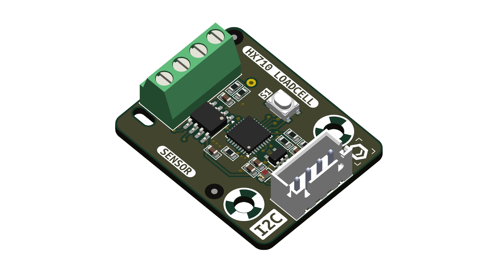
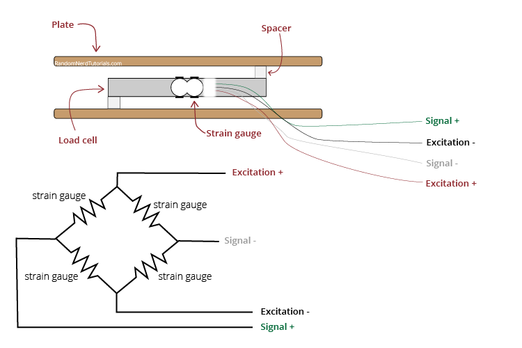
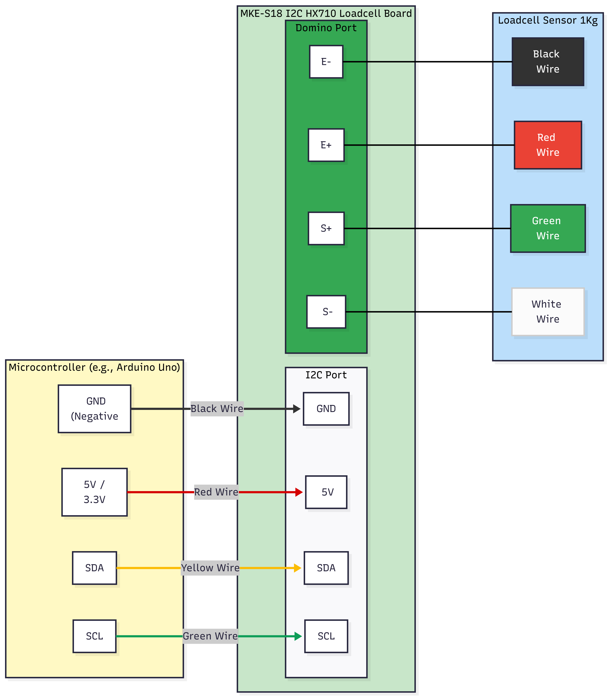

<details>
  <summary><b>PDF Export Style (Hidden on web)</b></summary>
  <style>
    @media print {
      @page {
        size: A4;
        margin: 16mm 15mm 16mm 15mm;
      }
      body {
        font-family: -apple-system, BlinkMacSystemFont, "Segoe UI", Roboto, Helvetica, Arial, sans-serif;
        font-size: 13.5px;
        line-height: 1.55;
      }
      h1, h2, h3, h4 {
        page-break-after: avoid !important;
        break-after: avoid !important;
      }
      pre, code, table, blockquote {
        page-break-inside: avoid !important;
        break-inside: avoid !important;
      }
      tr {
        page-break-inside: avoid !important;
        page-break-after: auto;
      }
    }
    .page-break {
      page-break-after: always;
      break-after: page;
    }
  </style>
</details>

# Hướng Dẫn Sử Dụng Module VNEHC I2C Loadcell (HX710) - Dành Cho Người Mới Bắt Đầu

**MKE-S18 HX710 I2C Loadcell Sensor** bao gồm cảm biến trọng lượng (Loadcell) và Module xử lý tín hiệu sử dụng **HX710**, một bộ chuyển đổi ADC 24-bit độ chính xác cao. Mạch tích hợp sẵn vi điều khiển **32-bit ARM Cortex-M0+** đảm nhiệm việc đọc, khử nhiễu và xử lý dữ liệu từ HX710, sau đó cung cấp dữ liệu trọng lượng trực tiếp thông qua giao tiếp **I2C**.

Nhờ thiết kế này, các vi điều khiển chính như **Arduino, ESP32, Raspberry Pi hay STM32** có thể dễ dàng đọc dữ liệu từ cân thông qua 2 chân tín hiệu `SDA` và `SCL`, giải phóng tài nguyên hệ thống. Mạch hỗ trợ điện áp giao tiếp **3.3V - 5VDC**, tương thích an toàn với hầu hết các board mạch phổ biến.

Tài liệu này sẽ hướng dẫn bạn cách thao tác trực tiếp trên mạch và lập trình module với Arduino bằng thư viện `MKE_I2C_Loadcell` một cách nhanh chóng nhất.

<div align="center">
  
</div>

---

## Phần 1: Sơ đồ chân & Kết nối phần cứng

Mạch giao tiếp với vi điều khiển qua chuẩn I2C (4 dây) và đọc tín hiệu từ cảm biến lực (Loadcell) qua Domino 4 chân.

<div align="center">
  
</div>

<div align="center">
  
</div>

### 1. Kết nối với Vi điều khiển (Cổng I2C)
- **GND:** Nối với chân GND (Âm nguồn) của Arduino/Vi điều khiển.
- **5V:** Nối với chân nguồn 5V (hoặc 3.3V) của Arduino/Vi điều khiển.
- **SDA:** Nối với chân SDA (Dữ liệu I2C).
- **SCL:** Nối với chân SCL (Xung nhịp I2C).

### 2. Kết nối với Cảm biến lực Loadcell (Cổng Domino)
- **E+ (Đỏ):** Nguồn dương cấp cho Loadcell (Excitation +).
- **E- (Đen):** Nguồn âm cấp cho Loadcell (Excitation -).
- **S+ (Xanh lá):** Tín hiệu dương từ Loadcell (Signal +).
- **S- (Trắng):** Tín hiệu âm từ Loadcell (Signal -).
> *Lưu ý: Màu dây có thể thay đổi tùy thuộc vào nhà sản xuất Loadcell, vui lòng kiểm tra datasheet của loại Loadcell bạn đang dùng.*

---

## Phần 2: Các Thao Tác Cơ Bản Trực Tiếp Trên Mạch

Trên mạch Loadcell có trang bị sẵn 1 nút nhấn nhỏ (`S1`), giúp bạn thao tác nhanh mà chưa cần phải viết code:

1. **Về 0 (Trừ bì / Tare):**
   - **Cách làm:** Bấm nút 1 lần (nhấn nhả).
   - **Tác dụng:** Mạch sẽ đặt khối lượng hiện tại về mức `0 gram`. (Mạch có độ trễ 1 giây sau khi bấm để tránh mạch bị rung rinh do lực tay).

2. **Khôi phục Cài đặt gốc (Factory Reset):**
   - **Cách làm:** Nhấn và giữ nút hơn 3 giây.
   - **Tác dụng:** Xoá toàn bộ các thông số đã cài và đưa địa chỉ I2C về mặc định là `0x0A`.

---

## Phần 3: Lập Trình Với Arduino

Thay vì phải tự gửi từng byte dữ liệu I2C phức tạp, bạn chỉ cần cài đặt thư viện và sử dụng các hàm đã được viết sẵn.

### Bước 0: Cài đặt thư viện
Thư viện `MKE_I2C_Loadcell` được quản lý tự động thông qua bộ thư viện lõi **MKE_ONE** của MakerEdu. Việc cài đặt rất đơn giản:
1. Mở phần mềm Arduino IDE.
2. Vào menu **Sketch > Include Library > Manage Libraries...** (hoặc nhấn phím tắt `Ctrl + Shift + I`).
3. Gõ từ khóa **`MKE_ONE`** vào ô tìm kiếm.
4. Tìm thư viện **MKE_ONE** (tác giả MakerEdu.vn) và nhấn **Install** (chọn *Install All* nếu Arduino hỏi cài đặt các thư viện phụ thuộc). 

Sau khi quá trình hoàn tất, thư viện `MKE_I2C_Loadcell` đã sẵn sàng để sử dụng.

### Bước 1: Khởi tạo thư viện
Đầu tiên, bạn cần gọi thư viện và khai báo đối tượng Loadcell:
```cpp
#include "MKE_I2C_Loadcell.h"

// Tạo một biến đại diện cho mạch Loadcell
MKE_I2C_Loadcell scale;
```

### Bước 2: Bắt đầu kết nối (Setup)
Trong hàm `setup()`, khởi động kết nối I2C và gọi lệnh `begin()`:
```cpp
void setup() {
  Serial.begin(115200);
  Wire.begin(); // Bắt buộc phải khởi tạo I2C trước tiên
  
  // Khởi động giao tiếp với module Loadcell
  if (!scale.begin()) {
    Serial.println(F("Khong tim thay Loadcell! Kiem tra day noi."));
    while(1) delay(100); // Dừng chương trình nếu lỗi
  }
  
  Serial.println(F("Ket noi Loadcell thanh cong!"));
  
  // Bạn có thể gọi tare() một lần ở đây để đưa về 0 lúc khởi động
  // scale.tare();
}
```

### Bước 3: Đọc dữ liệu (Loop)
Để đọc khối lượng hiện tại ra Gram, chỉ cần dùng hàm `getGram()`:
```cpp
void loop() {
  // Lấy giá trị khối lượng (gram)
  float weightGram = scale.getGram();
  
  Serial.print(F("Khoi luong: "));
  Serial.print(weightGram, 1);
  Serial.println(F(" g"));
  
  delay(500);
}
```

### Các Hàm Hữu Ích Khác
- `scale.tare()`: Gọi hàm này để trừ bì (đặt về 0) qua phần mềm.
- `scale.setFilterLevel(2)`: Chỉnh độ nhạy/mượt. `0`: Tốc độ phản hồi cực nhanh nhưng số nhảy liên tục, `3`: Số rất ổn định, chống rung tốt nhưng phản hồi chậm. Mặc định là `2`.
- `scale.getKilogram()`: Lấy khối lượng theo chuẩn Kilogram (Kg).

### Khi Nào Cần Hiệu Chuẩn (Calibrate)?
Khi mới mua về hoặc khi lắp đặt vào hệ cơ khí mới, số Gram đọc được có thể bị sai lệch. Bạn chỉ cần thực hiện hiệu chuẩn 1 lần duy nhất, mạch sẽ tự động tính toán hệ số Scale và **lưu vĩnh viễn vào bộ nhớ EEPROM**. Từ các lần bật nguồn sau, bạn không cần chạy lại code này nữa!

**Code mẫu hiệu chuẩn nhanh (ví dụ dùng tạ chuẩn 500g):**
```cpp
#include <Wire.h>
#include "MKE_I2C_Loadcell.h"

MKE_I2C_Loadcell scale;

// Khối lượng quả tạ chuẩn (Đơn vị: Gram)
const float REFERENCE_WEIGHT_GRAM = 500.0; 

void setup() {
  Serial.begin(115200);
  Wire.begin();
  
  if (!scale.begin()) {
    Serial.println(F("Khong tim thay Loadcell! Kiem tra day noi."));
    while (1) delay(100);
  }
  Serial.println(F("Ket noi Loadcell thanh cong!"));
  
  Serial.println(F("\n--- HUONG DAN ---"));
  Serial.println(F("1. Bo het do vat tren can ra, gui ky tu 't' de Tru bi (Ve 0)"));
  Serial.println(F("2. Dat qua ta chuan (VD: 500g) len can, gui ky tu 'c' de Hieu chuan"));
  Serial.println(F("-----------------\n"));
}

void loop() {
  if (Serial.available()) {
    char cmd = Serial.read();
    
    // TRỪ BÌ (TARE)
    if (cmd == 't' || cmd == 'T') {
      Serial.println(F("\n[CMD] Dang tru bi..."));
      scale.tare();
      Serial.println(F("-> Tru bi thanh cong. Khoi luong da ve 0."));
    } 
    // HIỆU CHUẨN (CALIBRATE)
    else if (cmd == 'c' || cmd == 'C') {
      Serial.print(F("\n[CMD] Dang hieu chuan voi qua ta: "));
      Serial.print(REFERENCE_WEIGHT_GRAM);
      Serial.println(F("g ..."));
      
      scale.calibrate(REFERENCE_WEIGHT_GRAM);
      delay(500); // Chờ module lưu vào EEPROM
      
      Serial.print(F("-> Hieu chuan thanh cong! He so Scale moi: "));
      Serial.println(scale.getScale(), 6);
    }
  }

  // In khối lượng liên tục
  float weight = scale.getGram();
  Serial.print(F("Khoi luong hien tai: "));
  Serial.print(weight, 1);
  Serial.println(F(" g"));
  
  delay(300);
}
```

### Cách Dùng Nhiều Cảm Biến Cùng Lúc
Để kết nối nhiều mạch Loadcell I2C vào chung 2 chân SDA/SCL, mỗi mạch phải có một địa chỉ I2C riêng biệt (mặc định tất cả đều là `0x0A`).
- **Bước 1:** Cắm duy nhất 1 mạch Loadcell vào Arduino và mở file ví dụ `07_Change_I2C_Address` trong thư viện để nạp lại địa chỉ mới (Ví dụ đổi thành `0x0B`).
- **Bước 2:** Lặp lại với các mạch khác nếu cần (đổi thành `0x0C`, `0x0D`...).
- **Bước 3:** Viết code khai báo và gọi hàm `begin` kèm theo địa chỉ tương ứng như sau:

**Code mẫu đọc 2 Loadcell cùng lúc:**
```cpp
#include <Wire.h>
#include "MKE_I2C_Loadcell.h"

// Khai báo 2 biến cho 2 mạch Loadcell
MKE_I2C_Loadcell scale1; // Mặc định là 0x0A
MKE_I2C_Loadcell scale2; // Sẽ dùng địa chỉ 0x0B

void setup() {
  Serial.begin(115200);
  Wire.begin();
  
  Serial.println(F("Dang khoi tao Loadcell..."));
  
  // Khởi tạo cân 1 (Địa chỉ mặc định 0x0A)
  if (!scale1.begin(0x0A)) {
    Serial.println(F("Khong tim thay Loadcell 1 (0x0A)!"));
  } else {
    Serial.println(F("Ket noi Loadcell 1 (0x0A) thanh cong!"));
  }

  // Khởi tạo cân 2 (Địa chỉ đã đổi thành 0x0B)
  if (!scale2.begin(0x0B)) {
    Serial.println(F("Khong tim thay Loadcell 2 (0x0B)! Ban da doi dia chi chua?"));
  } else {
    Serial.println(F("Ket noi Loadcell 2 (0x0B) thanh cong!"));
  }
}

void loop() {
  // Đọc khối lượng từ 2 mạch
  float weight1 = scale1.getGram();
  float weight2 = scale2.getGram();
  
  // In ra Serial Monitor
  Serial.print(F("Can 1 (0x0A): "));
  Serial.print(weight1, 1);
  Serial.print(F(" g \t| "));
  
  Serial.print(F("Can 2 (0x0B): "));
  Serial.print(weight2, 1);
  Serial.println(F(" g"));
  
  delay(500);
}
```

---

## Phần 4: Giao Thức I2C Cơ Bản (Dành cho nền tảng khác)

Nếu bạn không sử dụng Arduino (ví dụ: STM32, Raspberry Pi, ESP-IDF) và muốn tự viết driver, bạn có thể giao tiếp trực tiếp qua I2C.
Địa chỉ I2C mặc định của mạch là **`0x0A`**.

### Trình tự Giao tiếp I2C (Write & Read)
Bất kỳ lệnh nào (dù là lệnh Đọc hay Ghi) cũng đều phải tuân theo trình tự 3 bước sau để mạch Loadcell có thời gian xử lý:

1. **Gửi yêu cầu (Write 6 bytes):** I2C Master gửi một gói tin 6 bytes xuống mạch Loadcell:
   - `Byte 1`: Địa chỉ I2C của mạch (Ví dụ mặc định: `0x0A`).
   - `Byte 2`: Mã lệnh `Mode ID` (Xem bảng bên dưới).
   - `Byte 3 -> Byte 6`: Dữ liệu 32-bit (truyền theo thứ tự byte cao trước - Big Endian). Nếu lệnh không có dữ liệu gửi đi (chỉ yêu cầu đọc), hãy điền `0x00` cho 4 bytes này.
2. **Chờ xử lý:** Master bắt buộc phải tạo độ trễ (delay) tối thiểu **5ms**.
3. **Đọc kết quả (Read 4 bytes):** Master yêu cầu (Request) đọc 4 bytes kết quả từ mạch Loadcell. Dữ liệu trả về luôn là 32-bit (Big Endian). 
   - *Lưu ý: Riêng lệnh Đọc khối lượng (`0x34`), 4 bytes trả về mang định dạng Float 32-bit chuẩn IEEE 754. Bạn cần ép kiểu mảng byte nhận được về Float.*
   - **Ví dụ Code C/C++ chuyển đổi 4 byte sang Float:**
     ```c
     // Giả sử 4 byte nhận được từ I2C (Big Endian) lưu vào mảng buffer
     uint8_t buffer[4] = {0x43, 0x7A, 0x00, 0x00}; // Tương đương số 250.0
     
     // Bước 1: Ghép 4 byte thành 1 số nguyên 32-bit
     uint32_t raw_uint32 = ((uint32_t)buffer[0] << 24) | 
                           ((uint32_t)buffer[1] << 16) | 
                           ((uint32_t)buffer[2] << 8)  | 
                           ((uint32_t)buffer[3]);
     
     // Bước 2: Ép kiểu (Cast) bộ nhớ sang Float (Dùng memcpy để an toàn nhất)
     float weight_gram;
     memcpy(&weight_gram, &raw_uint32, sizeof(float)); 
     
     // Kết quả: weight_gram = 250.0
     ```

### Các Lệnh I2C Cơ Bản (Mở Rộng)
| Mode ID (Dec) | Mode ID (Hex) | Chức năng | Dữ liệu kèm theo |
| :---: | :---: | :--- | :--- |
| **10** | `0x0A` | Đọc địa chỉ I2C hiện tại | Nhận về uint32_t |
| **2** | `0x02` | Đọc ID của Module | Nhận về uint32_t |
| **4** | `0x04` | Đọc phiên bản Firmware | Nhận về uint32_t |
| **50** | `0x32` | Đọc giá trị ADC thô (Raw ADC) | Nhận về int32_t |
| **51** | `0x33` | Lệnh Trừ bì (Tare) | Ghi `0x00` (4 bytes) |
| **52** | `0x34` | Đọc Khối lượng (Gram) | Nhận về Float 32-bit |
| **53** | `0x35` | Hiệu chuẩn (Calibrate) | Ghi khối lượng Float 32-bit (Tự lưu EEPROM) |
| **54** | `0x36` | Đọc hệ số Scale | Nhận về Float 32-bit |
| **55** | `0x37` | Cài đặt hệ số Scale | Ghi hệ số Float 32-bit (Tự lưu EEPROM) |
| **58** | `0x3A` | Đọc Mức độ lọc (Filter Level) | Nhận về `0` đến `3` |
| **59** | `0x3B` | Cài đặt Mức độ lọc | Ghi `0` đến `3` (4 bytes) (Tự lưu EEPROM) |

