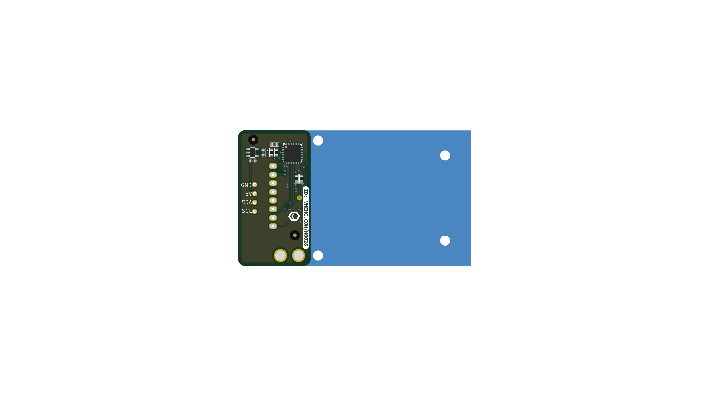
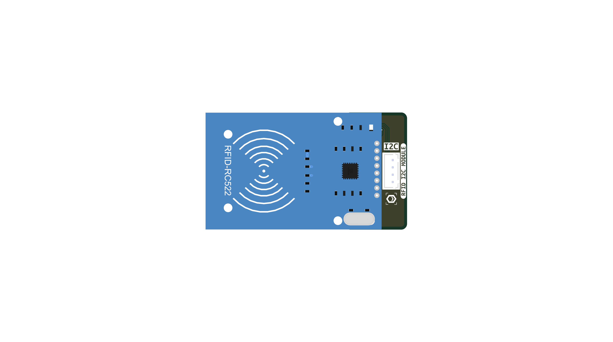
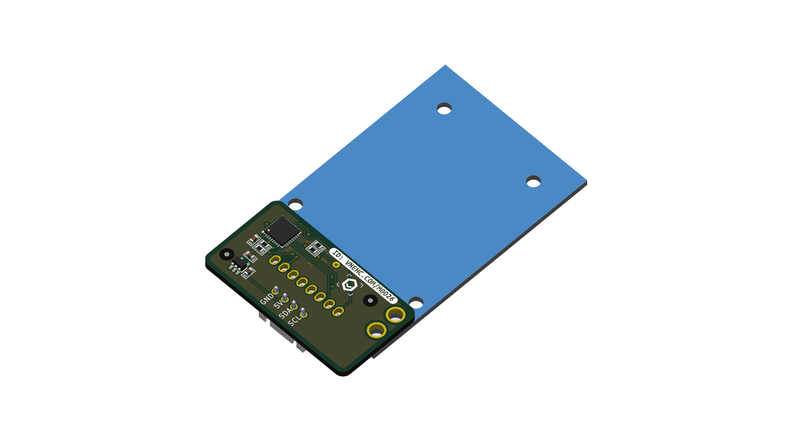
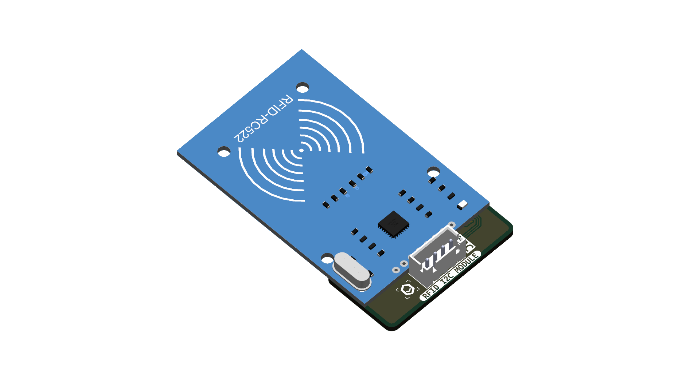

  
<b>PDF Export Style (Hidden on web)</b>

  

# MKE I2C RFID (RC522) User Manual

### 1. Introduction
MKE_I2C_RFID is an Arduino library designed to communicate with the RC522 RFID module via the I2C protocol, specifically developed for the MakerEdu ecosystem. Using I2C instead of SPI helps save precious GPIO pins and allows multiple modules to be connected on the same communication bus.

### 2. Library Installation
**IMPORTANT:** To ensure compatibility and automatic dependency management, please install the comprehensive **MKE_ONE** library package.

1. Open the Arduino IDE.
2. Navigate to **Sketch** -> **Include Library** -> **Manage Libraries...**
3. In the search bar, type `MKE_ONE`.
4. Locate the **MKE_ONE** library and click **Install**.

Once installed, the `MKE_I2C_RFID` library will automatically be available along with other libraries in the MakerEdu ecosystem.

### 3. Hardware Wiring

| RFID Module Pin | Arduino / ESP32 Pin | Function |
| :---: | :---: | :--- |
| **GND** | GND | Ground |
| **VCC** | 5V / 3.3V | Power Supply |
| **SDA** | SDA (A4 on Uno) | I2C Data |
| **SCL** | SCL (A5 on Uno) | I2C Clock |

*(Note: You can easily plug this via the corresponding MakerEdu expansion shield as illustrated below)*

### 4. Basic APIs
Below are some of the most commonly used methods of the `MKE_I2C_RFID` class to interact with MIFARE cards:

- `bool begin(uint8_t address = 0x29)`: Initializes the module with the given I2C address. Returns `true` if successful.
- `bool isCardPresent()`: Checks if there is an RFID card within the detection range.
- `uint32_t getUID()`: Reads the first 4 bytes of the card's UID.
- `void haltCard()`: Halts the card (Crucial: prevents continuous polling which can congest the I2C bus).
- `void setAuthKey(const uint8_t key[6])` / `uint8_t authenticateKeyA(uint8_t blockAddr)`: Authenticates Key A to gain Read/Write access to a block.
- `uint8_t readBlock(uint8_t blockAddr, uint8_t *buffer)`: Reads 16 bytes of data from a block.
- `uint8_t writeBlock(uint8_t blockAddr, const uint8_t *buffer)`: Writes 16 bytes of data to a block.

### 5. Advanced APIs
Exclusive to the `MKE_I2C_RFID_Advanced` class. These commands directly modify the EEPROM memory on the module's microcontroller.

> **⚠️ IMPORTANT NOTE:** Connect ONLY ONE module to the I2C bus when executing these commands to prevent accidentally changing the settings of other modules.

- `void unlockAdminMode(uint32_t password = 0xA5A5A5A5)`: Unlocks system write permissions.
- `void setI2CAddress(uint8_t newAddress)`: Changes the hardware I2C address (Requires `unlockAdminMode` first).
- `void factoryReset()`: Restores the module's factory defaults (Resets the I2C address to `0x29`).

### 6. Code Examples & Learning Outcomes
The library comes with a structured set of examples. Through these, you will gain the following knowledge:

1. **01_Read_UID**: Detecting a card and reading its unique identifier.
   - *Outcome*: Understand how RFID cards are detected and identified.
2. **02_DumpInfo**: Reading and displaying the entire memory content (Sectors/Blocks) of the card.
   - *Outcome*: Learn about the MIFARE memory structure comprehensively and the Key A/B authentication mechanism.
3. **03_Read_Write_Personal_Data**: Reading and writing custom data to a specific block.
   - *Outcome*: Know how to securely write application data (e.g., employee name) to the card.
4. **04_Digital_Wallet**: Advanced example simulating a digital wallet.
   - *Outcome*: How to perform value operations directly on a block (Deposit, Withdraw, Balance storage).
5. **05_Change_I2C_Address**: Changing the I2C address via software.
   - *Outcome*: Understand the authorization mechanism (Admin Mode) and how to safely override hardware configurations.
6. **06_Reset_Factory**: Restoring factory defaults.
   - *Outcome*: Learn how to remotely trigger a system reset and EEPROM wipe on the Slave module.
7. **07_I2C_Multiple_Device**: Communicating with multiple RFID modules simultaneously to read UIDs.
   - *Outcome*: Harness the power of the I2C bus to control multiple modules independently without conflicts.
8. **08_Compare_UID**: Reading and comparing a card's UID with a predefined UID to grant or deny access.
   - *Outcome*: Learn the fundamental logic behind access control systems, smart door locks, and employee attendance machines.

### 7. For Developers (Low-level I2C Protocol)
If you are developing for other platforms (MicroPython, ESP-IDF, Raspberry Pi) without the Arduino library, here is the underlying I2C protocol:

**A. Basic Protocol (Send 7 bytes, Receive 5 bytes):**
Most standard commands follow a strict 7-byte transmission and 5-byte reception format.
- **Send:** `[I2C_Addr, Mode_ID, Val0, Val1, Val2, Val3, Checksum]`
  *(Checksum = I2C_Addr ^ Mode_ID ^ Val0 ^ Val1 ^ Val2 ^ Val3)*
- **Receive (After 5-10ms):** `[Mode_Echo, Data0, Data1, Data2, Data3]`
- **Examples:**
  - `Mode 55 (0x37)`: Check if card is present (Data3 returns 1 if true).
  - `Mode 50 (0x32)`: Read 4-byte UID (returned in Data0..3).

**B. Working with MIFARE Cards (Advanced):**
Because MIFARE cards use 16-byte Blocks and 6-byte authentication Keys, the I2C protocol breaks down these payloads into sequential 4-byte packets:

**1. Authenticate Key A (6 bytes):**
Send three consecutive 7-byte commands, spaced by 50ms:
- `Mode 72 (0x48)`: Set the first 4 bytes of the Key into the system buffer.
- `Mode 73 (0x49)`: Set the last 2 bytes of the Key into the system buffer.
- `Mode 70 (0x46)`: Execute Auth Key A with `Val0` = Block Address. This uses the buffered 6-byte key. Returns `0` (STATUS_OK) on success.

**2. Read Block (16 bytes):**
- **Step 1:** Send `Mode 75 (0x4B)` (standard 7-byte packet) with `Val0` = Block Address.
- **Step 2:** Wait 50ms, then perform an I2C Read of exactly **18 bytes**.
- **Response Format:** `[Mode_Echo (75), Data0, Data1 ... Data15, Checksum]`.

**3. Write Block (16 bytes):**
Send five consecutive 7-byte commands, spaced by 50ms:
- `Mode 76 (0x4C)`: Send highest 4 Data bytes (Bytes 0-3).
- `Mode 77 (0x4D)`: Send next 4 Data bytes (Bytes 4-7).
- `Mode 78 (0x4E)`: Send next 4 Data bytes (Bytes 8-11).
- `Mode 79 (0x4F)`: Send lowest 4 Data bytes (Bytes 12-15).
- `Mode 80 (0x50)`: Execute Write command with `Val0` = Block Address. Returns `0` on success.

*Note: Always remember to send `Mode 100` (Halt Card) after finishing operations to prevent continuous polling from congesting the bus.*
